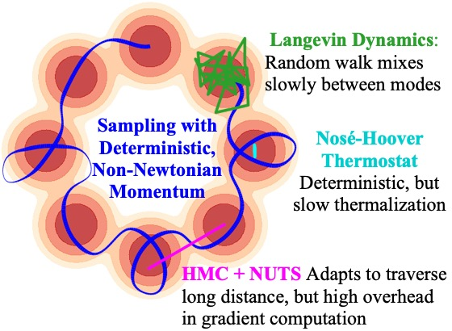

# Hamiltonian Dynamics with Non-Newtonian Momentum for Rapid Sampling
Code for the paper:

> Greg Ver Steeg and Aram Galstyan. "Hamiltonian Dynamics with Non-Newtonian Momentum for Rapid Sampling", NeurIPS 2021.
> [[preprint]](https://github.com/gregversteeg/esh_dynamics/blob/master/assets/draft.pdf) [[bibtex]](#bibtex)

<p align="center">

</p>

Non-Newtonian Momentum Animation:
<p align="center">

</p>

This repo contains code for implementing **E**nergy **S**ampling **H**amiltonian Dynamics, 
so-called because the Hamiltonian dynamics with this special form of Non-Newtonian momentum 
ergodically samples from a target un-normalized density specified by an energy function. 

## Requirements

The main sampler code for ESH dynamics is esh_leap.py and uses only PyTorch. 
```
python -m pip install git+https://github.com/gregversteeg/esh_dynamics
```
Use ``pip install -r requirements.txt`` for requirements for all evaluation code. 

## Usage
TODO: add a simple energy model, show Langevin vs ESH

```python
import torch as t
import esh  # ESH Dynamics integrator
from esh.GenerateFigures import ToyDataset  # Example energy models
from esh.GenerateFigures import hmc_integrate  # Sampling comparison methods, like Langevin

# Energy to sample - any pytorch function/module that outputs a scalar per batch item
energy = ToyDataset(toy_type='gmm').energy  # Gaussian mixture model

epsilon = 0.01  # Step size should be < 1
n_steps = 100  # Number of steps to take
x0 = t.tensor([[0., 0.5]])  # Initial state, size (batch_size, ...)
xs, vs, rs = esh.leap_integrate_chain(energy, x0, n_steps, epsilon, store=True)  # "Store" returns whole trajectory
xs_ula, vs_ula, _ = hmc_integrate(energy, x0, n_steps, epsilon=epsilon, k=1, mh_reject=False)  # Unadjusted Langevin Alg
```
To get just the last state instead of the whole trajectory, set store=False. 
To do ergodic reservoir sampling, set reservoir=True, store=False. 


## Generating figures

See the README in the ``generate_figures`` for scripts to generate each figure in the paper, 
and to see more example usage. 


## BibTeX

```markdown
@inproceedings{esh,
  title={Hamiltonian Dynamics with Non-Newtonian Momentum for Rapid Sampling},
  author={Greg {Ver Steeg} and Aram Galstyan},
  Booktitle={Advances in Neural Information Processing Systems},
  year={2021}
}
```

